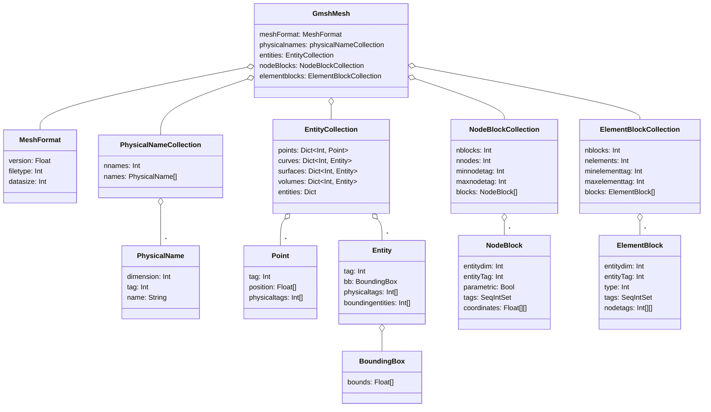

# Interface to Gmsh

## Gmsh Data Structure

```mermaid
classDiagram

    class GmshMesh {
      meshFormat: MeshFormat
      physicalnames: physicalNameCollection
      entities: EntityCollection
      nodeBlocks: NodeBlockCollection
      elementblocks: ElementBlockCollection
    }

    class MeshFormat {
      version: Float
      filetype: Int
      datasize: Int
    }

    class PhysicalNameCollection {
      nnames: Int
      names: PhysicalName[]
    }

    class PhysicalName {
      dimension: Int
      tag: Int
      name: String
    }

    class BoundingBox {
      bounds: Float[]
    }

    class EntityCollection {
      points: Dict<#8203;Int, Point#8203;>
      curves: Dict<#8203;Int, Entity#8203;>
      surfaces: Dict<#8203;Int, Entity#8203;>
      volumes: Dict<#8203;Int, Entity#8203;>
      entities: Dict
    }

    class Point {
      tag: Int
      position: Float[]
      physicaltags: Int[]
    }

    class Entity {
        tag: Int
        bb: BoundingBox
        physicaltags: Int[]
        boundingentities: Int[]
    }

    class NodeBlockCollection {
      nblocks: Int
      nnodes: Int
      minnodetag: Int
      maxnodetag: Int
      blocks: NodeBlock[]
    }

    class NodeBlock {
      entitydim: Int
      entityTag: Int
      parametric: Bool
      tags: SeqIntSet
      coordinates: Float[][]
    }

    class ElementBlockCollection {
      nblocks: Int
      nelements: Int
      minelementtag: Int
      maxelementtag: Int
      blocks: ElementBlock[]
    }

    class ElementBlock {
        entitydim: Int
        entityTag: Int
        type: Int
        tags: SeqIntSet
        nodetags: Int[][]
    }

    GmshMesh o-- MeshFormat
    GmshMesh o-- PhysicalNameCollection
    PhysicalNameCollection o-- "*" PhysicalName
    GmshMesh o-- EntityCollection
    GmshMesh o-- NodeBlockCollection
    NodeBlockCollection o-- "*" NodeBlock
    GmshMesh o-- ElementBlockCollection
    ElementBlockCollection o-- "*" ElementBlock
    EntityCollection o-- "*" Point
    EntityCollection o-- "*" Entity
    Entity o-- BoundingBox
```
